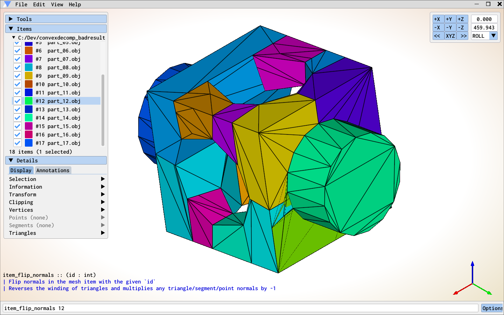

# Prizm

Prizm is a tool for debugging computational geometry algorithms using a simple workflow:

1. Write debug files using the [OBJ format](https://paulbourke.net/dataformats/obj/)
2. Inspect the files to find bugs

See the [wiki](https://github.com/okmatija/Prizm/wiki) for video tutorials. There is also a [Discord](https://discord.gg/zxKqvwmXNs) server.

  

There are many tools which can be used to implement this two-step debugging workflow (e.g., [MeshLab](https://www.meshlab.net/), [Polyscope](https://polyscope.run/), [ParaView](https://www.paraview.org/), [Meshmixer](https://meshmixer.com/), [Graphite](https://github.com/BrunoLevy/GraphiteThree), [VisIt](https://github.com/visit-dav/visit)). Prizm differs from these tools in the following ways:

* **Narrower scope**.  The tools listed above have modelling features, geometry processing features, or are platforms for _developing_ geometry processing algorithms. Prizm on the other hand is exclusively focused on the workflow outlined above, which means that it ships with only a small number of geometry processing features, the ones that have directly helped with debugging.  Furthermore, Prizm is not intended to be in development forever, once the issues for the `Version 1.0.0` milestone are addressed the program will stabilize and recieve only bug fix changes, to be maximally effective while debugging becoming familiar with your tools and being able to rely on them not changing much is helpful.

* **Simpler/faster UI/UX**.  This is of course a very subjective, but nevertheless the narrow scope of Prizm means that all the effort/iteration around improving UI/UX is necessarily focussed on the singular debugging use case.  This focus has (hopefully) resulted in a tool which enables users to identify and fix problems very quickly.  Prizm and its predecessors have been used for many years to debug problems arising in different domains and its feature set has evolved through direct experience. It should be useful when inspecting a single file or in cases where you need to sift through/transform a large set of files to identify a problem.

* **Simpler to extend**. It is common for other tools to be written in C++ and scriptable at runtime using Python.  The binding code to implement this interoperation complicates the program making it harder to understand/change/extend.  Prizm is implemented using [Jai](https://youtube.com/playlist?list=PLmV5I2fxaiCKfxMBrNsU1kgKJXD3PkyxO&si=WBp0cEltcc6PuWS5), a new systems programming language with powerful metaprogramming features and very fast compile times, together these features enable 'scripting' to be conveniently implemented via regular functions tagged with a `@RegisterCommand` [note](https://github.com/Jai-Community/Jai-Community-Library/wiki/Metaprogramming#notes) which the [build program](first.jai) can inspect to generate the boiler plate code so that the function can be called in the console\*.

* **Stand-alone**.  Some tools can directly embedded in your C++ program, and programmers familiar with graphics APIs can of course write their own visualization code for debugging directly in the original program.  This can be very helpful because you can inspect data as you step through your program.  Prizm is intentionally not a library and cannot be directly embedded in other programs, it is intended to be useful in any situtation where you might be developing geometry code, regardless of framework or language etc.  We have attempted to mitigate the downsides of having a stand-alone tool by implementing features which aim to support the same convenience\*\*

\* _Implementing hot code reloading is a high priority feature and should make Prizm's scripting workflow quite similar to the runtime scripting features available in other tools.  Also, as of March 2024, Jai is in closed beta which means that for most people Prizm will only be useful in binary form.  When the compiler is publically released people familiar with C++ should find Jai very easy to pick up._

\*\* _For example hot-reloading files/folders and supporting "always on top" transparent windows, see the [wiki](https://github.com/okmatija/Prizm/wiki) for more details.  Implementing a feature where your program can exchange data with Prizm via a shared memory channel/socket is a high priority feature._
